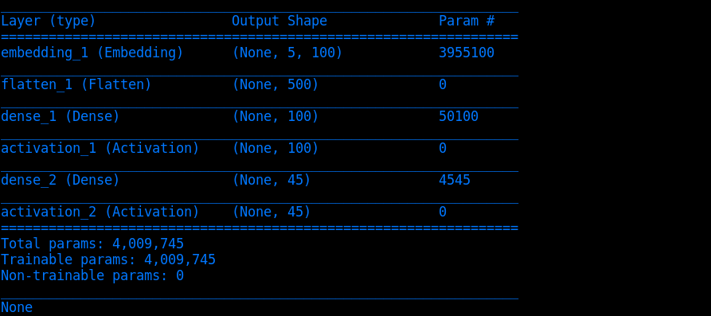

# FFNN_for_POStagging

This repository is for teaching and educational purpose, not relevant to my research!

In general, I use a feed forward neural network, which takes the embeddings of 5 consecutive words as the input and predicts the POS tag for the 3rd input word (the center word).
I use [Keras](https://keras.io/) for my implementation.
My network has the following layers. 
The embedding layer, which takes word indexes (shape [batch_size, word_num], dtype='int32') and outputs embeddings (shape [batch_size, word_num, embedding_dim], dtype='float32').
A Flatten layer, flattening tensors of shape [batch_size, word_num, embedding_dim] to be shape [batch_size, word_num\*embedding_dim].
Then two Dense layers, followed by a softmax layer.

The architecture looks like this

To train the system, first type "python prep.py" to prepare data, then type "python tagger.py" to train the tagger.

To install background softwares:

1. pip --upgrade --user keras
2. pip --upgrade --user tensorflow
